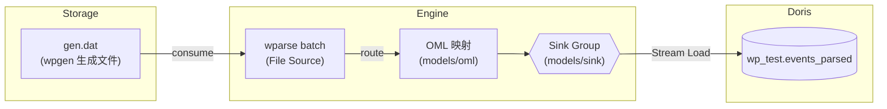
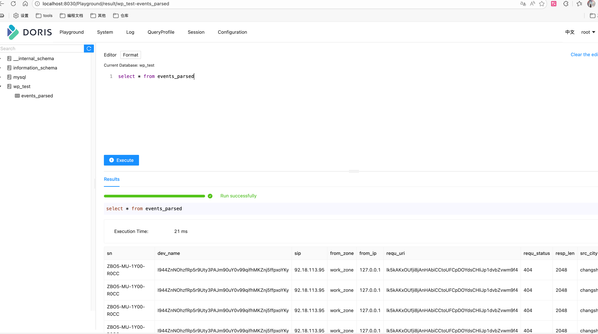

# doris 使用说明

本目录提供一套 **File Source → Doris Stream Load** 的端到端示例，用来验证 WarpParse 在离线文件解析后写入 Doris 的链路是否按预期工作。

- 采集端：`wpgen` 生成样例日志，落盘到 `data/in_dat/gen.dat`
- 引擎端：`wparse batch` 读取文件 Source，按照 WPL/OML 解析映射
- 写入端：`doris_sink` 通过 Stream Load 将结果写入 Doris，同时保留 prototext 文件用于校验

## 数据流图



如渲染不支持 Mermaid，可参考 ASCII 版：

```
wpgen(sample) --> gen.dat --> wparse(batch+file_src) --> [OML/route] --> sinks{file_proto,doris_stream_load}
    sinks --> Doris: wp_test.events_parsed
```

## 目录结构

- `conf/`
  - `wpgen.toml`：样例生成配置，可调数量/速率
  - `wparse.toml`：引擎主配置（模型目录、拓扑、并发、日志等）
- `topology/`
  - `sources/wpsrc.toml`：File Source 监听 `./data/in_dat/gen.dat`
  - `sinks/business.d/example.toml`：Sink 组，既输出 prototext，也写 Doris
- `models/`：`wpl` 解析规则与 `oml` 字段映射（`models/oml/benchmark2/adm.oml` 等）
- `data/`：样例输入、输出、日志（`run.sh` 会自动清理/复用）
- `run.sh`：一键脚本，负责生成数据、执行 wparse、统计校验与 Doris 查询

说明：Source/Sink 连接器均引用仓库根目录 `connectors/` 中的定义：

- `connectors/source.d/10-file.toml`（id=`file_src`，允许覆写 `base/file/encode`）
- `connectors/sink.d/50-doris.toml`（id=`doris_sink`，允许覆写 `endpoint/database/table/mapping`）

## 前置要求

1. 已安装并配置 `wproj`、`wpgen`、`wparse` CLI
2. 可用的 Doris 集群，可通过 `facilities/doris/start-doris.sh` 启动单机 FE/BE

## 快速开始

1. 创建doris集群
```bash
sh ./facilities/doris/start-doris.sh
```
2. 解析日志
```bash
cd extensions/doris
./run.sh             # 默认 debug 模式
```
3. 查看内容
  - 进入：`http://localhost:8030/Playground/result/wp_test-events_parsed`页面
  - 执行查询语句：`select * from events_parsed`
  

脚本步骤：

1. `wproj check` → `wproj data clean` → `wpgen data clean`，保证目录干净
2. 使用 `wpgen rule` 生成 `LINE_CNT` 条样例文件（默认 `data/in_dat/gen.dat`）
3. 执行 `wparse batch --stat 2 -S 1 -p` 从 File Source 解析
4. `wproj data stat` & `wproj data validate --input-cnt LINE_CNT` 校验输出

### 常用环境变量

| 变量 | 默认值 | 说明 |
| --- | --- | --- |
| `LINE_CNT` | `5000` | 每次生成/处理的样本数量 |
| `STAT_SEC` | `3` | `wpgen`/`wparse` 统计间隔 |
| `DATA_FILE` | `./data/in_dat/gen.dat` | File Source 读取路径 |
| `DORIS_HOST` / `DORIS_PORT` | `127.0.0.1` / `9030` | Doris MySQL 接入地址 |
| `DORIS_DB` / `DORIS_TABLE` | `wp_test` / `events_parsed` | Doris 库表名 |
| `DORIS_USER` / `DORIS_PASSWORD` | `root` / 空 | Doris 账号信息 |

示例：

```bash
LINE_CNT=20000 STAT_SEC=5 \
DORIS_DB=doris_demo DORIS_TABLE=log_events \
DORIS_HOST=docker.for.mac.localhost DORIS_PASSWORD=secret ./run.sh
```

## 配置说明
```toml
[[sink_group.sinks]]
name = "doris_stream_load"
connect = "doris_sink"
[sink_group.sinks.params]
endpoint = "mysql://localhost:9030?charset=utf8mb4&connect_timeout=10"
database = "wp_test"
table = "events_parsed"
user = "root"
password = ""
pool_size = 4
batch_size = 2048
# create_table = """..."""
```

关键字段说明：

- `endpoint`：Stream Load 所使用的 Doris FE MySQL 访问地址（支持多参）
- `database`/`table`：目标库表，需与 Doris 实际对象一致
- `user`/`password`：Doris 登录信息，支持空密码
- `pool_size`：连接池大小（默认 4），可按写入并发调大
- `batch_size`：单批写入的事件数量，建议与 Doris 负载、超时时间匹配
- `create_table`：可选的建表 SQL，库中不存在时自动执行


## 常见问题

- **Doris 连接失败**：确认 `endpoint` 地址可访问，用户/密码正确，FE 已开启 MySQL 接口
- **权限不足**：需要为 Doris 账号授予 `SELECT/INSERT`，以及 Stream Load 所需的 `LOAD` 权限
- **字段不匹配**：检查 `models/oml` 和 Doris 表结构，必要时通过 oml 调整顺序/命名
- **文件找不到**：确保 `DATA_FILE` 路径与 `topology/sources/wpsrc.toml` 一致，或重新运行脚本生成样例

完成以上配置即可在本地快速验证 File→Doris Stream Load 的完整链路。欢迎按需扩展模型、字段或接入真实数据。
