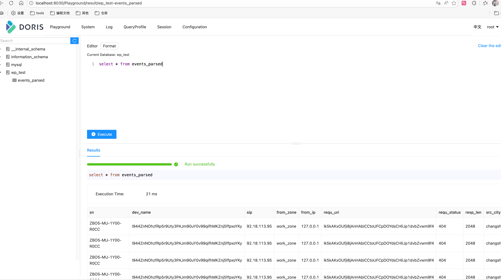

## Doris用例描述
本doris用例构建了一个从: 文件->wparse->doris的场景。


## 前提
1. 启动docker compose：`docker compose up -d`
2. 等待doris启动后，创建test.sql中的库表
3. 查看内容：
- 进入：http://localhost:8030/Playground/result/wp_test-events_parsed页面
- 执行查询语句：select * from events_parsed


## 配置介绍
```
[connectors.params]

# Stream Load API 配置（新版）
endpoint = "http://localhost:8040"  # 使用 BE 的 HTTP 端口（推荐）
user = "root"   #用户名
password = ""   #密码
database = "test_db"    #数据库
table = "events_parsed" # 表名
timeout_secs = 30       # 超时时间
max_retries = 3         # 重试次数
batch_size = 100_0000   # 通用参数 批量大小

# 可选：自定义 Stream Load 参数 
[connectors.params.headers]
strip_outer_array = "false"
max_filter_ratio = "0.1"
strict_mode = "false"
```

