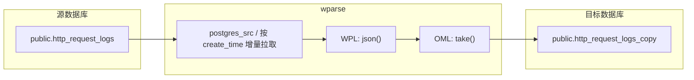

# pg\_postgres

`pg_postgres` 用例当前验证的是一条 `Postgres Source -> WPL/OML -> Postgres Sink` 的端到端链路：

- 从 PostgreSQL 源表 `public.http_request_logs` 按游标增量读取数据
- 经 `models/wpl/nginx/parse.wpl` 与 `models/oml/nginx.oml` 处理
- 写入 PostgreSQL 目标表 `public.http_request_logs_copy`

## 使用前先看

## 当前默认数据流



如渲染环境不支持 Mermaid，可参考 ASCII 版：

```text
Postgres(public.http_request_logs)
  -> postgres_src(cursor=create_time)
  -> wparse
  -> WPL(json) + OML(take)
  -> postgres_sink
  -> Postgres(public.http_request_logs_copy)
```

## 目录结构

- `conf/wparse.toml`：引擎主配置，声明模型目录、拓扑目录、日志目录和性能参数
- `conf/wpgen.toml`：历史 TCP 打流配置；当前默认拓扑不依赖它
- `topology/sources/wpsrc.toml`：当前唯一业务数据源，使用 `postgres_src` 从 `http_request_logs` 读数
- `topology/sinks/business.d/all.toml`：当前业务 Sink，使用 `postgres_sink` 写入 `http_request_logs_copy`
- `topology/sinks/defaults.toml` 与 `topology/sinks/infra.d/*.toml`：默认、错误、漏数、监控、残留等辅助 sink
- `models/wpl/nginx/parse.wpl`：WPL 规则，当前使用 `json()` 解析
- `models/oml/nginx.oml`：OML 模型，当前为字段透传
- `models/knowledge/`：本地 KnowDB 示例数据，`wparse` 启动时会一并加载
- `scripty/create_http_request_logs.py`：创建源表和目标表
- `scripty/insert_http_request_logs_1000.py`：向源表 `public.http_request_logs` 追加测试数据
- `scripty/preparatory_work.sql`：历史示例 `nginx_logs` 表结构，不参与当前默认链路
- `run.sh`：过渡态脚本；会启动 `wparse`，但其中的 `wpgen sample` 不是当前默认数据来源

连接器定义位于仓库根目录 `connectors/`：

- `connectors/source.d/50-postgres.toml`：`id = "postgres_src"`
- `connectors/sink.d/60-postgres.toml`：`id = "postgres_sink"`

## 前置要求

- 已安装并可直接执行 `wproj`、`wparse`
- 本机可访问 PostgreSQL，默认连接参数与 `docker-compose.yml` 一致：
  - `PGHOST=127.0.0.1`
  - `PGPORT=5432`
  - `PGDATABASE=wparse`
  - `PGUSER=postgres`
  - `PGPASSWORD=123456`
- 如需使用辅助建表/灌数脚本，已安装 Python 驱动：

```bash
python3 -m pip install 'psycopg[binary]'
```

如本机尚未启动 PostgreSQL，可直接使用本目录的 Compose 文件：

```bash
docker compose up -d postgres
```

## 推荐验证流程

以下步骤与当前仓库配置完全对齐，推荐优先使用。

### 1. 创建源表和目标表

```bash
python3 scripty/create_http_request_logs.py
```

脚本会创建两张表：

- `public.http_request_logs`：Postgres Source 读取的源表
- `public.http_request_logs_copy`：Postgres Sink 写入的目标表

### 2. 向源表写入测试数据

默认写入 1000 条，也可以自行指定条数：

```bash
python3 scripty/insert_http_request_logs_1000.py
python3 scripty/insert_http_request_logs_1000.py 5000
```

写入脚本会先锁表，再基于当前最大 `id` 与 `create_time` 继续生成数据，因此重复执行时会持续追加新数据。

### 3. 检查项目配置

```bash
wproj check
```

### 4. 启动 `wparse`

推荐直接在当前目录启动：

```bash
wparse daemon --stat 5
```

说明：

- `wparse deamon` 也是可用别名，`run.sh` 里当前使用的是这个旧别名
- 启动后会按 `topology/sources/wpsrc.toml` 中的配置，从 `public.http_request_logs` 按 `create_time` 游标拉取数据
- 日志默认写入 `data/logs/wparse.log`

如果你希望后台运行，可以参考：

```bash
wparse daemon --stat 5 &
```

处理完成后，再根据 `.run/wparse.pid` 或当前 shell 里的后台任务手动停止进程。

### 5. 校验结果

先比对源表和目标表的记录数

## 关键配置说明

### `topology/sources/wpsrc.toml`

当前源配置如下：

```toml
[[sources]]
enable = true
key = "postgres_1"
connect = "postgres_src"
params = {
  endpoint = "localhost:5432",
  username = "postgres",
  password = "123456",
  database = "wparse",
  table = "http_request_logs",
  cursor_column = "create_time",
  cursor_type = "time"
}
```

这个示例的含义是：

- 使用 `postgres_src` 从 PostgreSQL 表 `public.http_request_logs` 持续增量读取
- 使用 `create_time` 作为时间游标，因此 `cursor_type = "time"`
- 每次读取到一批数据后，会把当前批次最后一条记录的游标值写入 checkpoint

可结合 `pg_source` 文档理解以下参数：

| 参数              | 当前示例值               | 说明                                |
| --------------- | ------------------- | --------------------------------- |
| `endpoint`      | `localhost:5432`    | PostgreSQL 地址，格式为 `host:port`     |
| `username`      | `postgres`          | 连接用户名                             |
| `password`      | `123456`            | 连接密码                              |
| `database`      | `wparse`            | 数据库名                              |
| `table`         | `http_request_logs` | 目标表名；未显式配置 `schema` 时默认取 `public` |
| `cursor_column` | `create_time`       | 增量游标列                             |
| `cursor_type`   | `time`              | 当前支持 `int` 或 `time`               |

按 `pg_source` 文档，`postgres_src` 还支持但当前示例未显式使用这些参数：

| 参数                  | 默认值      | 说明                              |
| ------------------- | -------- | ------------------------------- |
| `schema`            | `public` | schema 名                        |
| `batch`             | `1000`   | 每批读取条数                          |
| `start_from`        | 无        | 首次启动且没有 checkpoint 时的起点         |
| `start_from_format` | 无        | 仅 `time` 游标使用，用于解析 `start_from` |
| `poll_interval_ms`  | `1000`   | 无新数据时的轮询间隔                      |
| `error_backoff_ms`  | `2000`   | 查询失败时的退避间隔                      |

当前这个用例最需要注意的几点：

- `cursor_type = "time"` 适用于 PostgreSQL 原生时间列，例如 `timestamptz`、`timestamp`、`date`
- 不建议把文本时间列当作时间游标
- 如果时间游标值会重复且可能跨批截断，存在漏读风险；这属于游标字段选型问题
- 如果你追求更稳的增量采集，优先使用单调递增且唯一的整数游标

查询行为可以理解为：

- 已有 checkpoint 时：`WHERE create_time > last_cursor ORDER BY create_time ASC LIMIT batch`
- 没有 checkpoint 但配置了 `start_from` 时：`WHERE create_time > start_from ORDER BY create_time ASC LIMIT batch`
- 既没有 checkpoint 也没有 `start_from` 时：从最小游标开始读取，不带下界

关于 `start_from`：

- 只在“当前没有 checkpoint”时生效
- 一旦 `.run/.checkpoints/postgres_1.json` 已存在，就会优先使用 checkpoint，忽略 `start_from`
- `time` 游标下可以配合 `start_from_format` 使用，例如 `unix_s`、`unix_ms` 或 `%Y-%m-%d %H:%M:%S`

Checkpoint 行为：

- 文件位置：`.run/.checkpoints/postgres_1.json`
- 作用：记录 source 已经读到哪个游标值
- 注意：它记录的是 source 读取进度，不是下游 sink 已成功写入的进度
- 如果你修改了 `cursor_column` 或 `cursor_type`，通常需要同步清理旧 checkpoint

返回数据格式上，`postgres_src` 会把每一行转成 JSON 文本，并自动追加 `warp_parse_table` 字段，值为源表名。当前用例的 WPL 是 `json()`，因此可以直接解析这类输入。

### `topology/sinks/business.d/all.toml`

当前业务 Sink 配置如下：

```toml
[sink_group]
name = "all"
rule = ["/*"]

[[sink_group.sinks]]
name = "main"
connect = "postgres_sink"
[sink_group.sinks.params]
endpoint = "localhost:5432"
username = "postgres"
password = "123456"
database = "wparse"
table = "http_request_logs_copy"
columns = ["sip", "timestamp", "http/request", "status", "create_time", "id", "update_time"]
batch_size = 10
```

关注点：

- 当前目标表固定为 `http_request_logs_copy`
- Sink 只会写 `columns` 中列出的字段
- 若你调整表结构，记得同步更新这里的字段映射

### `conf/wparse.toml`

当前关键参数：

- `parse_workers = 1`
- `rate_limit_rps = 30000`
- 日志目录：`./data/logs`
- WPL 目录：`./models/wpl`
- OML 目录：`./models/oml`
- Source 拓扑目录：`./topology/sources`
- Sink 拓扑目录：`./topology/sinks`

### 解析与映射模型

- `models/wpl/nginx/parse.wpl`：当前仅执行 `json()` 解析
- `models/oml/nginx.oml`：当前使用 `take()` 透传字段，不额外改名或脱敏

## 关于 `run.sh` 与 `wpgen.toml`

这两个文件目前仍在仓库中，但请注意它们与当前默认数据链路并不完全一致：

- `run.sh` 仍会执行 `wpgen sample`
- `conf/wpgen.toml` 仍指向 `tcp_sink` 和端口 `19001`
- 但当前 `topology/sources/wpsrc.toml` 的业务 Source 已切换为 `postgres_src`

这意味着：

- `run.sh` 可以继续用于执行 `wproj check`、`wproj data clean`、启动/停止 `wparse`
- 但它里面的 `wpgen sample` 不是当前默认链路的数据入口
- 如果源表里没有新数据，运行脚本后目标表也不会有新增记录

如果你的目标是验证当前默认的 Postgres 到 Postgres 链路，请优先按照“推荐验证流程”手动执行。

## 重复验证与游标说明

由于当前 Source 使用 `create_time` 游标：

- 第一次消费完成后，进度会持久化到 `.run/.checkpoints/postgres_1.json`
- 第二次启动时，默认只读取新的 `create_time`
- 最简单的重复验证方式是再次执行 `scripty/insert_http_request_logs_1000.py` 追加新数据

如果你确实需要从头回放，请先备份现场，再手动清理 checkpoint 和目标表数据。

## 历史文件说明

`scripty/preparatory_work.sql` 创建的是历史示例表 `nginx_logs`。它适用于旧版 `nginx_logs` 入库演示，不参与当前默认的 `http_request_logs -> http_request_logs_copy` 链路。

## 常见问题

### 1. `wproj check` 通过了，但目标表没有新数据

优先检查以下几项：

- 源表 `public.http_request_logs` 是否真的有数据
- 新数据的 `create_time` 是否大于当前 checkpoint 记录的游标
- `topology/sinks/business.d/all.toml` 指向的目标表是否存在
- `data/logs/wparse.log` 中是否有连接失败或字段映射错误

### 2. 重复运行时读取不到旧数据

这是当前游标设计的预期行为，不是故障。因为 `postgres_src` 会从 `.run/.checkpoints/postgres_1.json` 记录的位置继续读取。

### 3. 字段不匹配或写入失败

确保以下几处保持一致：

- 源表字段
- `topology/sinks/business.d/all.toml` 中的 `columns`
- 目标表字段定义

尤其是 `"http/request"`、`"timestamp"` 这类带特殊字符或保留含义的列名，在 SQL 中要使用双引号。

### 4. 需要验证 TCP 打流而不是 Postgres Source

当前目录不是最合适的用例。请改看同级 `extensions/tcp_postgres/`，或者自行把 `topology/sources/wpsrc.toml` 切回 TCP Source 配置。
