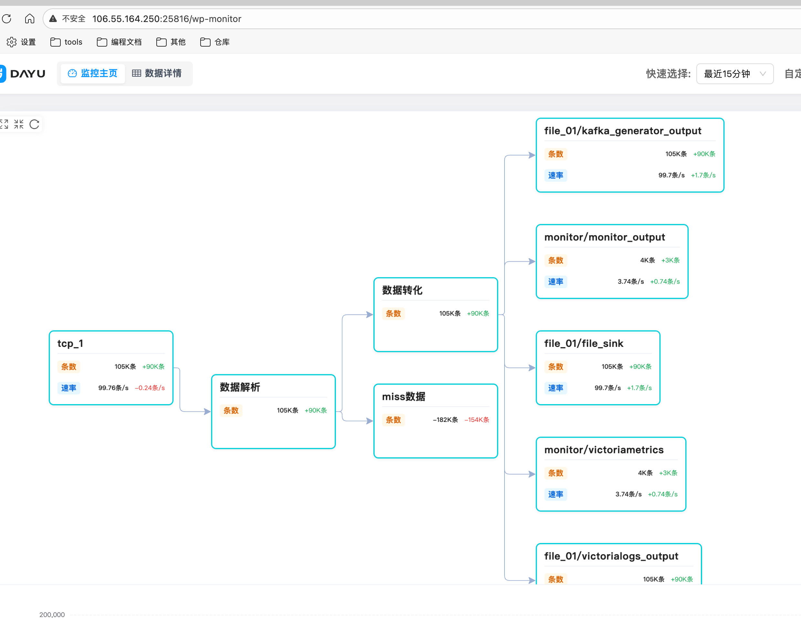
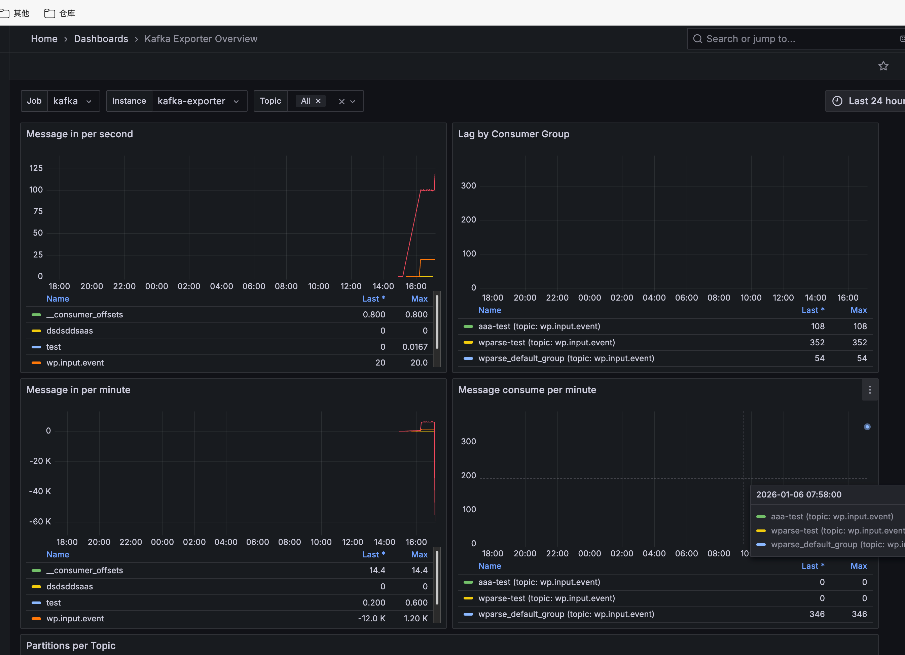
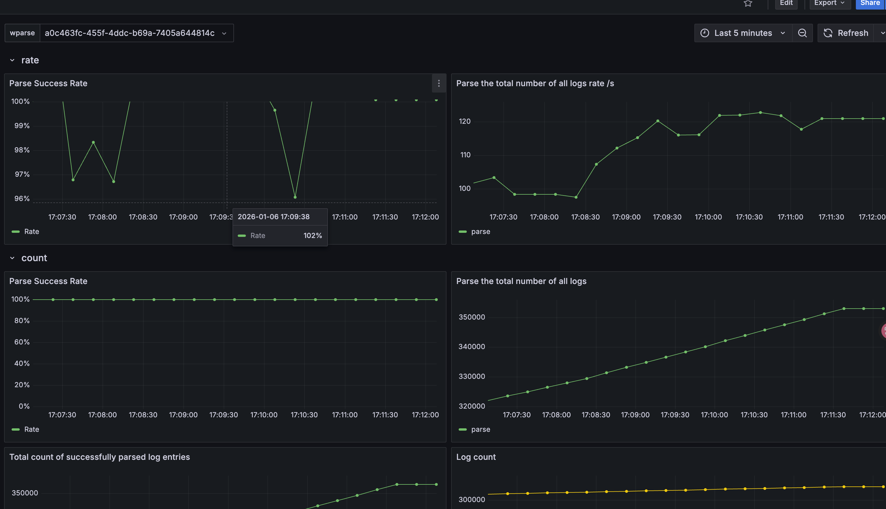

# Practice - Real-World Multi-Source Monitoring

## Overview

This example demonstrates a real-world scenario that includes log collection, parsing, writing to multiple backends, and monitoring. The diagram above illustrates the use case architecture.

- wpgen periodically sends data to files, Fluent-bit TCP, and Kafka, simulating log sources.
- Fluent-bit collects file logs and listens on port 5170, forwarding logs to wparse for parsing.
- wparse listens on TCP and Kafka, receives various logs for parsing and classification, and routes them by log type (currently nginx only) to different outputs such as Kafka, files, and VictoriaLogs.

## Deployment Architecture

You can use VictoriaLogs to view various logs: [VLogs URL](http://106.55.164.250:9428/select/vmui/?#/?query=src%3Akafka&g0.range_input=5m&g0.end_input=2025-12-31T06%3A38%3A06&g0.relative_time=last_5_minutes)

Querying logs from Kafka input:

Querying logs from TCP input:

## Monitoring

This example uses VictoriaMetrics to monitor key components including Fluent-bit, Kafka, and wparse. External monitoring is available via Grafana: [Related Link](http://106.55.164.250:8428/vmui/?#/?g0.expr=up&g0.range_input=30m&g0.end_input=2025-12-31T06%3A42%3A54&g0.tab=0&g0.relative_time=last_30_minutes)

### wp-monitor

wp-monitor is a proprietary metrics visualization component based on system architecture. Link: `http://106.55.164.250:25816/wp-monitor`.

### Grafana Monitoring

Credentials:
- Grafana username: admin
- Grafana password: admin
---
Currently we provide dashboards for Kafka and wparse:
- [Kafka](http://106.55.164.250:3000/d/jwPKIsniz12/kafka-exporter-overview?orgId=1&from=now-24h&to=now&timezone=browser&var-job=kafka&var-instance=kafka-exporter&var-topic=$__all)

- [wparse](http://106.55.164.250:3000/d/df9b7ju8eo8owe/wparse-view?orgId=1&from=now-5m&to=now&timezone=browser&var-wparse=45e45da3-01f1-46c1-a30b-fd0e1a442bb4)

## Usage

> Prerequisites: Docker images referenced in docker-compose must be pullable and match your CPU architecture.

### Method 1: Manual Start (Recommended for macOS)

- Enter working directory: `cd wp-examples/extensions/practice`
- Update the output address in `fluent-bit.yml` to the actual wparse address:

- Start Docker components: `docker compose up -d`
- Enter wparse working directory: `cd parse-work`
- Start wparse: `wparse daemon --stat 10 -p> data/logs/wparse-info.log 2>&1 &`
- Start data generators:
  - `wpgen sample -c wpgen-kafka.toml --stat 10 -p > data/logs/wpgen-kafka.log 2>&1 &`
  - `wpgen sample -c wpgen-tcp.toml --stat 10 -p > data/logs/wpgen-tcp.log 2>&1 &`
  - `wpgen sample -c wpgen-file.toml --stat 10 -p > data/logs/wpgen-file.log 2>&1 &`

### Method 2: One-Click Start Script

> The script depends on nohup, which is typically available on Linux systems.

- Enter working directory: `cd wp-examples/extensions/practice`
- Update the output address in `fluent-bit.yml` to the actual wparse address:

- Start Docker components: `docker compose up -d`
- Start: `./run.sh`
- Stop: `./stop.sh`

---

# Practice - 实战多源监控场景 (中文)

## 示例介绍
本示例是一个基于实践场景下的用例。该场景包括了日志收集、解析、入多个库、监控，上面是该用例的示意图。

- wpgen定期向文件、fluent-bit TCP、Kafka发送数据，模拟日志来源。
- fluent-bit收集文件日志、监听5170端口，将日志转发到wparse做解析。
- wparse监听TCP和Kafka，将接收各类日志进行解析和分类，并根据日志类型（目前只有nginx）转发到不同的输出源，如kafka、文件、vlogs。

## 部署结构

可以使用vlogs进行查看：各类日志[Vlog地址](http://106.55.164.250:9428/select/vmui/?#/?query=src%3Akafka&g0.range_input=5m&g0.end_input=2025-12-31T06%3A38%3A06&g0.relative_time=last_5_minutes)

查询kafka输入的日志

查询TCP输入的日志

## 监控
本例子使用Victoria-metrics对fluent-bit、kafka、以及wparse几个关键组件的监控。外部可以使用grafana进行监控：[相关链接](http://106.55.164.250:8428/vmui/?#/?g0.expr=up&g0.range_input=30m&g0.end_input=2025-12-31T06%3A42%3A54&g0.tab=0&g0.relative_time=last_30_minutes)

### wp-monitor监控
wp-monitor是我司自研的一款基于系统结构的指标展示组件，链接:`http://106.55.164.250:25816/wp-monitor`。

### grafana监控
账号：
- grafana账号：admin
- grafana密码：admin
---
目前我们提供了kafka和wparse的仪表盘
- [kafka](http://106.55.164.250:3000/d/jwPKIsniz12/kafka-exporter-overview?orgId=1&from=now-24h&to=now&timezone=browser&var-job=kafka&var-instance=kafka-exporter&var-topic=$__all)

- [wparse](http://106.55.164.250:3000/d/df9b7ju8eo8owe/wparse-view?orgId=1&from=now-5m&to=now&timezone=browser&var-wparse=45e45da3-01f1-46c1-a30b-fd0e1a442bb4)

## 项目使用
> 前置条件：可以拉取docker-copmose中的镜像,并且镜像的CPU架构一致
### 方式1 手工启动(MAC推荐)
- 进入工作目录：`cd wp-examples/extensions/practice`
- 将fluent-bit.yml中输出地址信息改为实际的wparse地址：

- 启动docker相关组件：`docker compose up -d`

- 进入wparse工作目录:`cd parse-work`
- 启动wparse：`wparse daemon --stat 10 -p> data/logs/wparse-info.log 2>&1 &`
- 启动发送相关工具：
  - `wpgen sample -c wpgen-kafka.toml --stat 10 -p > data/logs/wpgen-kafka.log 2>&1 &`
  - `wpgen sample -c wpgen-tcp.toml --stat 10 -p > data/logs/wpgen-tcp.log 2>&1 &`
  - `wpgen sample -c wpgen-file.toml --stat 10 -p > data/logs/wpgen-file.log 2>&1 &`

### 方式二 一键化启动脚本
> 脚本依赖于nohup,一般linux会带此工具
- 进入工作目录：`cd wp-examples/extensions/practice`
- 将fluent-bit.yml中输出地址信息改为实际的wparse地址：

- 启动docker相关组件：`docker compose up -d`
- 执行：`./run.sh`
- 停止：`./stop.sh`
