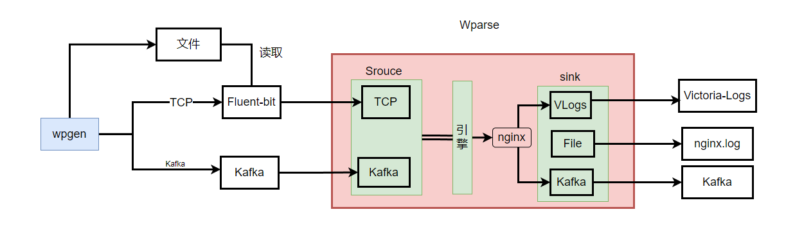
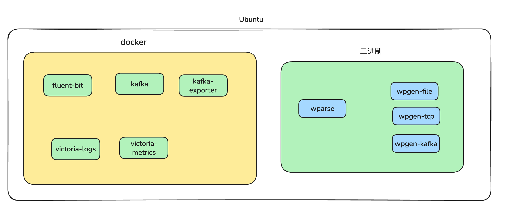
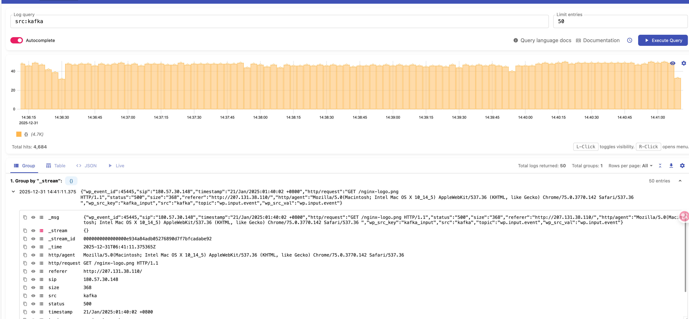
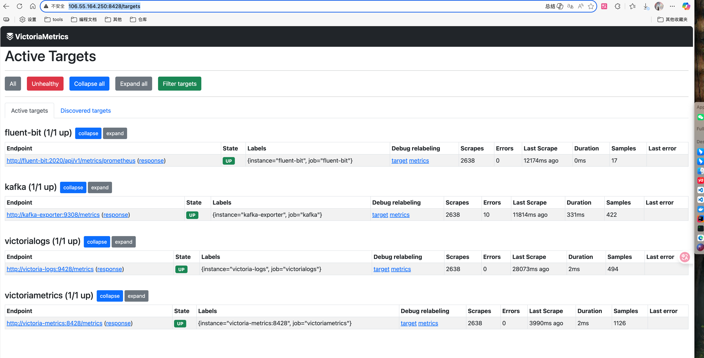
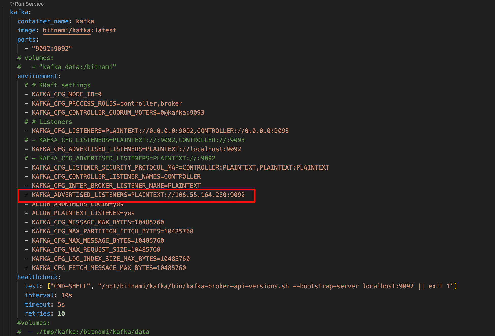

## 示例介绍
本示例是一个基于实践场景下的用例。该场景包括了日志收集、解析、入多个库、监控，上面是该用例的示意图。

- wpgen定期向文件、fluent-bit TCP、Kafka发送数据，模拟日志来源。
- fluent-bit收集文件日志、监听5170端口，将日志转发到wparse做解析。
- wparse监听TCP和Kafka，将接收各类日志进行解析和分类，并根据日志类型（目前只有nginx）转发到不同的输出源，如kafka、文件、vlogs。

## 部署结构

可以使用vlogs进行查看：各类日志[Vlog地址](http://106.55.164.250:9428/select/vmui/?#/?query=src%3Akafka&g0.range_input=5m&g0.end_input=2025-12-31T06%3A38%3A06&g0.relative_time=last_5_minutes)

查询kafka输入的日志

查询TCP输入的日志

## 监控
本例子使用Victoria-metrics对fluent-bit、kafka、以及wparse几个关键组件的监控。[相关链接](http://106.55.164.250:8428/vmui/?#/?g0.expr=up&g0.range_input=30m&g0.end_input=2025-12-31T06%3A42%3A54&g0.tab=0&g0.relative_time=last_30_minutes)

## 项目使用
> 前置条件：可以拉取docker-copmose中的镜像,并且镜像的CPU架构一致
### 方式1 手工启动
- 进入工作目录：`cd wp-examples/extensions/practice`
- 将docker-compose中kafka相关的地址信息改为实际地址：

- 启动docker相关组件：`docker compose up -d`

- 进入wparse工作目录:`cd parse-work`
- 启动wparse：`wparse daemon --stat 2 -p`
- 启动发送相关工具：
    - `wpgen sample -c wpgen-kafka.toml --stat 2 -p`
    - `wpgen sample -c wpgen-tcp.toml --stat 2 -p`
    - `wpgen sample -c wpgen-file.toml --stat 2 -p`

### 方式二 一键化启动脚本
- 进入工作目录：`cd wp-examples/extensions/practice`
- 将docker-compose中kafka相关的地址信息改为实际地址：

- 执行：`./run.sh`
