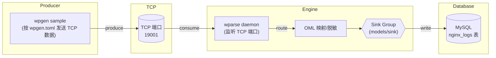

# wp-extensions/tcp_mysql 使用说明

本目录提供一套基于 TCP 传输的端到端 MySQL 入库用例，验证统一 TCP Source 与 MySQL Sink 连接器是否按预期工作。

- 发送端：`wpgen` 将样例数据通过 TCP 协议发送到指定端口（默认 19001）
- 引擎端：`wparse` 监听 TCP 端口接收数据，解析并路由到 MySQL Sink 完成入库
- 验证端：通过 MySQL 查询验证数据是否正确入库

## 数据流图

下图展示 tcp_mysql 的数据流与关键环节。



如渲染不支持 Mermaid，可参考 ASCII 版：

```
wpgen(sample) --> TCP(TCP:19001) --> wparse(daemon) --> [OML/route] --> sinks{mysql}
    sinks --> MySQL: nginx_logs 表
```

## 目录结构

- `conf/`
  - `wparse.toml`：引擎主配置（目录/并发/日志等）
  - `wpgen.toml`：数据生成器配置（已指向 TCP sink，并配置端口）
- `topology/sources/wpsrc.toml`：Source 路由（包含 `tcp_1` 监听 19001 端口）
- `topology/sinks/business.d/all.toml`：业务 Sink 路由（包含 MySQL sink，配置入库字段）
- `models/oml/nginx.oml`：OML 模型（结果字段映射/脱敏）
- `models/wpl/nginx/`：WPL 解析规则与样例数据
- `preparatory_work.sql`：MySQL 表结构定义
- `run.sh`：一键运行脚本

说明：Source 与 Sink 连接器 id 引用仓库根目录 `connectors/` 下的定义：
- `connectors/source.d/20-tcp.toml`：id=`tcp_src`（允许覆写 `port/prefer_newline`）
- `connectors/sink.d/20-mysql.toml`：id=`mysql_sink`（允许覆写 `table/columns/dsn` 等）

## 前置要求

- 本机已启动 MySQL，默认地址 `127.0.0.1:3306`（或通过环境变量覆盖，见下文）
- 确保目标数据库中已创建 `nginx_logs` 表（执行 `create_table.sql`）
- 注意自定义数据库表需要其中必要的字段`wp_event_id`作为主键且为BIGINT类型

## 快速开始

进入用例目录并运行脚本（默认 `debug`）：

```bash
cd extensions/tcp_mysql
./run.sh            # 或 ./run.sh release
```

脚本主要步骤：
1) `wproj check` 进行配置自检，清理数据目录
2) 后台启动 `wparse daemon`（监听 TCP 19001 端口）
3) 执行 `wpgen sample` 生成样例数据并通过 TCP 发送
4) 等待数据入库，停止 `wparse`
5) 执行 `wproj data stat` 与 `wproj data validate` 进行校验

## 运行参数

脚本支持以下可选环境变量：

- `LINE_CNT`：生成/处理的样例条数，默认 `100`
- `SPEED_MAX`：最大发送速率（条/秒），默认 `5000`

示例：

```bash
LINE_CNT=1000 SPEED_MAX=10000 ./run.sh
```

## 配置说明

### wpgen.toml（数据生成器配置）

```toml
[generator]
mode = "sample"
count = 1000        # 生成样例数量
speed = 0           # 发送速率限制，0 表示不限速
parallel = 4        # 并发数

[output]
name = "gen_out"
connect = "tcp_sink"
params = { port = 19001 }
```

### wparse.toml（引擎配置）

```toml
[models]
wpl = "./models/wpl"
oml = "./models/oml"

[topology]
sources = "./topology/sources"
sinks = "./topology/sinks"

[performance]
parse_workers = 2   # 解析并发数
rate_limit_rps = 0  # 限速，0 表示不限速
```

### topology/sinks/business.d/all.toml（MySQL Sink 配置）

```toml
[sink_group]
name = "all"
rule = ["/*"]
parallel = 8

[[sink_group.sinks]]
name = "main"
connect = "mysql_sink"
params = { 
    columns = ["sip", "timestamp", "http/request", "status", "size", "referer", "http/agent", "wp_event_id"] 
}
```

## 数据库准备

执行以下 SQL 创建目标表：

```bash
mysql -h 127.0.0.1 -u root -p wparse < preparatory_work.sql
```

或直接复制 `preparatory_work.sql` 内容到 MySQL 客户端执行。

## 结果验证

- MySQL 入库验证：连接数据库查询 `nginx_logs` 表，确认记录数与数据内容

```bash
mysql -h 127.0.0.1 -u root -p your_database -e "SELECT COUNT(*) FROM nginx_logs; SELECT * FROM nginx_logs LIMIT 100;"
```

- 数据统计：`wproj data stat` 会输出各阶段处理统计
- 数据校验：`wproj data validate` 会校验输入输出数据一致性

## 常见问题排查

- **连接失败**：确认 MySQL 服务已启动，用户有目标数据库访问权限，表已创建
- **端口冲突**：确保 19001 端口未被占用，或修改 `topology/sources/wpsrc.toml` 中的端口配置
- **无数据入库**：检查 `data/logs/` 下的日志文件，确认 TCP 连接与解析是否正常
- **字段不匹配**：确认 `topology/sinks/business.d/all.toml` 中的 `columns` 与 `create_table.sql` 表结构一致
