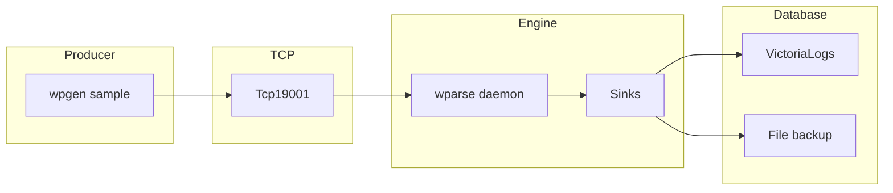

# wp-extensions/tcp_victorialogs 使用说明

本目录提供一套基于 TCP 传输的端到端 VictoriaLogs 入库用例，验证统一 TCP Source 与 VictoriaLogs Sink 连接器是否按预期工作。

- 发送端：`wpgen` 将样例数据通过 TCP 协议发送到指定端口（默认 19001）
- 引擎端：`wparse` 监听 TCP 端口接收数据，解析并路由到 VictoriaLogs Sink 完成入库
- 验证端：通过 VictoriaLogs HTTP API 查询验证数据是否正确入库

## 数据流图

下图展示 tcp_victorialogs 的数据流与关键环节。



如渲染不支持 Mermaid，可参考 ASCII 版：

```
wpgen(sample) --> TCP:19001 --> wparse(daemon) --> Sinks
                                              ├──> VictoriaLogs
                                              └──> all.dat
```

## 目录结构

- `conf/`
  - `wparse.toml`：引擎主配置（目录/并发/日志等）
  - `wpgen.toml`：数据生成器配置（已指向 TCP sink，并配置端口）
- `topology/sources/wpsrc.toml`：Source 路由（包含 `tcp_1` 监听 19001 端口）
- `topology/sinks/business.d/all.toml`：业务 Sink 路由（包含 VictoriaLogs sink 与文件 sink）
- `models/oml/nginx.oml`：OML 模型（结果字段映射/脱敏）
- `models/wpl/nginx/`：WPL 解析规则与样例数据
- `run.sh`：一键运行脚本

说明：Source 与 Sink 连接器 id 引用仓库根目录 `connectors/` 下的定义：

- `connectors/source.d/20-tcp.toml`：id=`tcp_src`（允许覆写 `port/prefer_newline`）
- `connectors/sink.d/40-victorialogs.toml`：id=`victorialogs_sink`（允许覆写 `endpoint/insert_path/flush_interval_secs/create_time_field`）
字段解释如下
  - `endpoint`：VictoriaLogs HTTP 地址，默认 `http://127.0.0.1:9428`
  - `insert_path`：插入路径，默认 `/insert/jsonline`
  - `flush_interval_secs`: 解析出的日志推送时间间隔，默认 `3`
  - `create_time_field`：存入 VictoriaLogs 中的时间字段（注意其中的字段是需要在WPL中使用时间函数解析），默认为空则采用插入 VictoriaLogs 的时间戳

## 前置要求

- 本机已启动 VictoriaLogs，默认地址 `http://127.0.0.1:9428`（或通过环境变量覆盖，见下文）
- 确保 VictoriaLogs 的 HTTP 服务可访问
- 可以直接使用本项目中提供的docker-compose.yml启动VictoriaLogs，但是注意项目中提供的docker-compose.yml中能查询到的数据范围为最近400d的数据

## 快速开始

进入用例目录并运行脚本（默认 `debug`）：

```bash
cd extensions/tcp_victorialogs
./run.sh            # 或 ./run.sh release
```

脚本主要步骤：

1) `wproj check` 进行配置自检，清理数据目录
2) 后台启动 `wparse daemon`（监听 TCP 19001 端口）
3) 执行 `wpgen sample` 生成样例数据并通过 TCP 发送
4) 等待数据入库，停止 `wparse`
5) 执行 `wproj data stat` 与 `wproj data validate` 进行校验

## 运行参数

脚本支持以下可选环境变量：

- `LINE_CNT`：生成/处理的样例条数，默认 `100`
- `SPEED_MAX`：最大发送速率（条/秒），默认 `5000`

示例：

```bash
LINE_CNT=1000 SPEED_MAX=10000 ./run.sh
```

## 配置说明

### wpgen.toml（数据生成器配置）

```toml
[generator]
mode = "sample"
count = 1000        # 生成样例数量
speed = 0           # 发送速率限制，0 表示不限速
parallel = 4        # 并发数

[output]
name = "gen_out"
connect = "tcp_sink"
params = { port = 19001 }
```

### wparse.toml（引擎配置）

```toml
[models]
wpl = "./models/wpl"
oml = "./models/oml"

[topology]
sources = "./topology/sources"
sinks = "./topology/sinks"

[performance]
parse_workers = 2   # 解析并发数
rate_limit_rps = 0  # 限速，0 表示不限速
```

### topology/sinks/business.d/all.toml（Sink 配置）

```toml
[sink_group]
name = "all"
rule = ["/*"]
parallel = 8

[[sink_group.sinks]]
name = "victorialogs_output"
connect = "victorialogs_sink"
params = { 
    endpoint = "http://127.0.0.1:9428", 
    insert_path = "/insert/jsonline", 
    flush_interval_secs = 3, 
    create_time_field = "timestamp" 
}

[[sink_group.sinks]]
name = "main"
connect = "file_proto_sink"
params = { file = "all.dat" }
```

## 结果验证

- VictoriaLogs 入库验证：通过 HTTP API 查询数据

```bash
curl 'http://127.0.0.1:9428/api/ui/query?query={_any="*"}&limit=10'
```

- 数据统计：`wproj data stat` 会输出各阶段处理统计
- 数据校验：`wproj data validate` 会校验输入输出数据一致性
- 文件备份：`all.dat` 文件会保存原始解析后的数据

## VictoriaLogs 查询示例

按时时间范围查询（限制 100 条）：

```bash
curl --location --request POST 'http://localhost:9428/select/logsql/query' \
--header 'User-Agent: Apifox/1.0.0 (https://apifox.com)' \
--header 'Content-Type: application/x-www-form-urlencoded' \
--header 'Accept: */*' \
--header 'Host: localhost:9428' \
--header 'Connection: keep-alive' \
--data-urlencode 'query=*' \
--data-urlencode 'start=2025-12-27T09:30:20.251Z' \
--data-urlencode 'end=2025-12-29T09:30:20.251Z' \
--data-urlencode 'limit=100'
```

## 常见问题排查

- **连接失败**：确认 VictoriaLogs 服务已启动，HTTP 端口（默认 9428）可访问
- **端口冲突**：确保 19001 端口未被占用，或修改 `topology/sources/wpsrc.toml` 中的端口配置
- **无数据入库**：检查 `data/logs/` 下的日志文件，确认 TCP 连接与解析是否正常
- **查询无结果**：确认 `victorialogs_sink` 的 `endpoint` 与 `insert_path` 配置正确
- **时间字段问题**：如需使用时间序列功能，确认 `create_time_field` 配置为数据中存在的时间字段名
