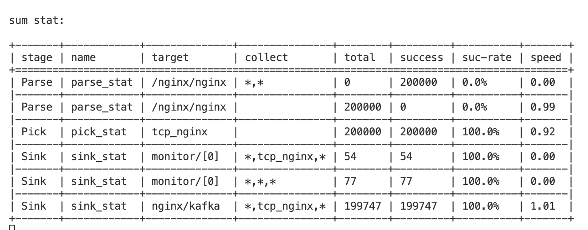

## 测试背景
- 测试版本：wparse 0.13.1
> Vlogs测试采用的是wparse 0.13.2

- 测试机器：MAC mini

## 测试方式
### 丢数据测试
准备一个4w行日志的文件，通过读取文件向目标发送，最总收到数是否等于4w。
### 重启测试
监听TCP端口，20s内向waprse写入20w数据，在此期间重启目标组件，查看急救文件和目标接收的数量是否正确。

## 连接器稳定性测试报告
连接器 | File输入丢数据测试 | TCP输入丢数据测试| 重启测试丢数据率 | 是否有错误（连接断开除外）
--- | --- | --- | --- | ---
kafka | 不存在 | 不存在 | 稳定 | total stat显示问题 
vlogs | 存在 | 不存在 | -0.84%| total stat显示问题 
mysql | 存在 | 不存在 | -0.04%| total stat显示问题 
doris | 存在 | 不存在 | -0.05%| total stat显示问题 

## 详细问题记录
### 所有组件均存在问题
- total stat显示问题：实际到达20w条、只显示到达199747条

- 单FILE输入过早停止导致丢数据问题（KAFKA除外）

### vlogs
- 单file丢数据问题：不重启情况下，4w行日志只收到了21,245行，且未生成急救文件。
- 重启急救文件对不上问题：TCP发送20w，只收到了121,567，加急救文件61652，总计183219，小于20w,偏差率：-0.84%

### mysql
- 单file丢数据问题：不重启情况下，4w行日志只收到了23,936行，且未生成急救文件。

- 重启急救文件对不上问题：TCP发送20w，只收到了119679，加急救文件80223，总计199902，小于20w,偏差率：-0.04%

### doris
- 单file丢数据问题：不重启情况下，4w行日志只收到了23,218行，且未生成急救文件。
- 重启急救文件对不上问题：TCP发送20w，只收到了13888，加急救文件186000，总计199888，小于20w,偏差率：-0.05%