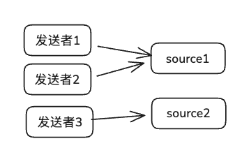

影响功能的因素如下：
日志类型、发送者与source数量、source类型、model类型、sink与接收者数量、sink类型、网络因素、重启。
最终的测试用例数量是上诉因素相乘。

### 日志类型
对于日志类型：存在如下类测试.
- 单类型对单wpl
- 单类型对多wpl
- 多类型对单wpl
- 多类型对多wpl
    - 1.输入均有对应wpl
    - 2.输入与wpl只存在交集，但并不等价（重点测）   
      

日志类型覆盖示例如下（除特别说明外，均可与其它因素笛卡尔积组合）：
1. 发送（nginx）→wpl（nginx）
2. 发送（nginx）→wpl（nginx, cloud）
3. 发送（nginx, sys）→wpl（sys）
4. 发送（nginx, nginx外包json, sys, sys外包json）→wpl（nginx, nginx外包json, sys, sys外包json）
5. 发送（nginx, nginx外包json, sys, sys外包json）→wpl（nginx, nginx外包json, cloud）（重点场景：输入类型与wpl只存在交集）

多类型对多wpl的2实例：
- 输入：nginx类型、nginx外包一层json、sys类型、sys外包一层json。
- wpl：nginx类型、nginx外包一层json、sys类型、cloud类型。

> 注：日志类型还可以根据日志结构再细分，但细分到日志结构工作量太大，且目前有哪些结构缺乏整理.

### 发送者数量
> 注意：发送者类因素和source类型因素不是同一类，每一类source类型都可以有如下测试

发送者数量存在如下类测试
- 单发送对单source（大部分已经做过）
- 多发送对单source
- 多发送对多source（重点测）

实例：  

### model类型
model也存在不同的操作类型，但是model主要做数据重命名，我认为该操作测试优先级不高，是否可以忽略。

### source类型
tcp、kafka、syslog 的所有组合均被纳入测试：
- kafka
- kafka+tcp
- kafka+syslog
- tcp+syslog
- kafka+tcp+syslog

### sink与接收者数量
- 单sink对单接收（大部分已经做过）
- 多sink对单接收
- 多sink对多接收（重点测）

### sink类型
kafka、vlog、file、MYSQL、doris 的 1~5 组合全部覆盖（共 31 种，详见用例清单），例如：
- kafka
- kafka+vlog
- kafka+file+MYSQL
- vlog+file+MYSQL+doris
- kafka+vlog+file+MYSQL+doris

### 网络因素

网络因素存在如下类网络波动：
- 发送者->source
- sink->接收者
- 两个阶段都有波动

### 用例
完整笛卡尔积清单请见 `usecases.md`（共 29295 条组合）。以下列出上诉的重点用例。
#### 重点用例清单

日志类型：发送（nginx, nginx外包json, sys, sys外包json）→wpl（nginx, nginx外包json, cloud），发送者/Source数量=多发送者→多source，Sink数量=多sink→多接收。下表罗列所有 Source/Sink 组合（至少包含两类类型）与 3 种网络因素的排列。

共 312 条重点组合(除去网络影响，需要准备104个例子)

编号 | Source类型组合 | Sink类型组合 | 网络因素
--- | --- | --- | ---
P001 (SRC04-DST06-NET1) | kafka+tcp | kafka+vlog | 关注发送者→source链路
P002 (SRC04-DST06-NET2) | kafka+tcp | kafka+vlog | 关注sink→接收者链路
P003 (SRC04-DST06-NET3) | kafka+tcp | kafka+vlog | 两个链路均存在波动
P004 (SRC04-DST07-NET1) | kafka+tcp | kafka+file | 关注发送者→source链路
P005 (SRC04-DST07-NET2) | kafka+tcp | kafka+file | 关注sink→接收者链路
P006 (SRC04-DST07-NET3) | kafka+tcp | kafka+file | 两个链路均存在波动
P007 (SRC04-DST08-NET1) | kafka+tcp | kafka+MYSQL | 关注发送者→source链路
P008 (SRC04-DST08-NET2) | kafka+tcp | kafka+MYSQL | 关注sink→接收者链路
P009 (SRC04-DST08-NET3) | kafka+tcp | kafka+MYSQL | 两个链路均存在波动
P010 (SRC04-DST09-NET1) | kafka+tcp | kafka+doris | 关注发送者→source链路
P011 (SRC04-DST09-NET2) | kafka+tcp | kafka+doris | 关注sink→接收者链路
P012 (SRC04-DST09-NET3) | kafka+tcp | kafka+doris | 两个链路均存在波动
P013 (SRC04-DST10-NET1) | kafka+tcp | vlog+file | 关注发送者→source链路
P014 (SRC04-DST10-NET2) | kafka+tcp | vlog+file | 关注sink→接收者链路
P015 (SRC04-DST10-NET3) | kafka+tcp | vlog+file | 两个链路均存在波动
P016 (SRC04-DST11-NET1) | kafka+tcp | vlog+MYSQL | 关注发送者→source链路
P017 (SRC04-DST11-NET2) | kafka+tcp | vlog+MYSQL | 关注sink→接收者链路
P018 (SRC04-DST11-NET3) | kafka+tcp | vlog+MYSQL | 两个链路均存在波动
P019 (SRC04-DST12-NET1) | kafka+tcp | vlog+doris | 关注发送者→source链路
P020 (SRC04-DST12-NET2) | kafka+tcp | vlog+doris | 关注sink→接收者链路
P021 (SRC04-DST12-NET3) | kafka+tcp | vlog+doris | 两个链路均存在波动
P022 (SRC04-DST13-NET1) | kafka+tcp | file+MYSQL | 关注发送者→source链路
P023 (SRC04-DST13-NET2) | kafka+tcp | file+MYSQL | 关注sink→接收者链路
P024 (SRC04-DST13-NET3) | kafka+tcp | file+MYSQL | 两个链路均存在波动
P025 (SRC04-DST14-NET1) | kafka+tcp | file+doris | 关注发送者→source链路
P026 (SRC04-DST14-NET2) | kafka+tcp | file+doris | 关注sink→接收者链路
P027 (SRC04-DST14-NET3) | kafka+tcp | file+doris | 两个链路均存在波动
P028 (SRC04-DST15-NET1) | kafka+tcp | MYSQL+doris | 关注发送者→source链路
P029 (SRC04-DST15-NET2) | kafka+tcp | MYSQL+doris | 关注sink→接收者链路
P030 (SRC04-DST15-NET3) | kafka+tcp | MYSQL+doris | 两个链路均存在波动
P031 (SRC04-DST16-NET1) | kafka+tcp | kafka+vlog+file | 关注发送者→source链路
P032 (SRC04-DST16-NET2) | kafka+tcp | kafka+vlog+file | 关注sink→接收者链路
P033 (SRC04-DST16-NET3) | kafka+tcp | kafka+vlog+file | 两个链路均存在波动
P034 (SRC04-DST17-NET1) | kafka+tcp | kafka+vlog+MYSQL | 关注发送者→source链路
P035 (SRC04-DST17-NET2) | kafka+tcp | kafka+vlog+MYSQL | 关注sink→接收者链路
P036 (SRC04-DST17-NET3) | kafka+tcp | kafka+vlog+MYSQL | 两个链路均存在波动
P037 (SRC04-DST18-NET1) | kafka+tcp | kafka+vlog+doris | 关注发送者→source链路
P038 (SRC04-DST18-NET2) | kafka+tcp | kafka+vlog+doris | 关注sink→接收者链路
P039 (SRC04-DST18-NET3) | kafka+tcp | kafka+vlog+doris | 两个链路均存在波动
P040 (SRC04-DST19-NET1) | kafka+tcp | kafka+file+MYSQL | 关注发送者→source链路
P041 (SRC04-DST19-NET2) | kafka+tcp | kafka+file+MYSQL | 关注sink→接收者链路
P042 (SRC04-DST19-NET3) | kafka+tcp | kafka+file+MYSQL | 两个链路均存在波动
P043 (SRC04-DST20-NET1) | kafka+tcp | kafka+file+doris | 关注发送者→source链路
P044 (SRC04-DST20-NET2) | kafka+tcp | kafka+file+doris | 关注sink→接收者链路
P045 (SRC04-DST20-NET3) | kafka+tcp | kafka+file+doris | 两个链路均存在波动
P046 (SRC04-DST21-NET1) | kafka+tcp | kafka+MYSQL+doris | 关注发送者→source链路
P047 (SRC04-DST21-NET2) | kafka+tcp | kafka+MYSQL+doris | 关注sink→接收者链路
P048 (SRC04-DST21-NET3) | kafka+tcp | kafka+MYSQL+doris | 两个链路均存在波动
P049 (SRC04-DST22-NET1) | kafka+tcp | vlog+file+MYSQL | 关注发送者→source链路
P050 (SRC04-DST22-NET2) | kafka+tcp | vlog+file+MYSQL | 关注sink→接收者链路
P051 (SRC04-DST22-NET3) | kafka+tcp | vlog+file+MYSQL | 两个链路均存在波动
P052 (SRC04-DST23-NET1) | kafka+tcp | vlog+file+doris | 关注发送者→source链路
P053 (SRC04-DST23-NET2) | kafka+tcp | vlog+file+doris | 关注sink→接收者链路
P054 (SRC04-DST23-NET3) | kafka+tcp | vlog+file+doris | 两个链路均存在波动
P055 (SRC04-DST24-NET1) | kafka+tcp | vlog+MYSQL+doris | 关注发送者→source链路
P056 (SRC04-DST24-NET2) | kafka+tcp | vlog+MYSQL+doris | 关注sink→接收者链路
P057 (SRC04-DST24-NET3) | kafka+tcp | vlog+MYSQL+doris | 两个链路均存在波动
P058 (SRC04-DST25-NET1) | kafka+tcp | file+MYSQL+doris | 关注发送者→source链路
P059 (SRC04-DST25-NET2) | kafka+tcp | file+MYSQL+doris | 关注sink→接收者链路
P060 (SRC04-DST25-NET3) | kafka+tcp | file+MYSQL+doris | 两个链路均存在波动
P061 (SRC04-DST26-NET1) | kafka+tcp | kafka+vlog+file+MYSQL | 关注发送者→source链路
P062 (SRC04-DST26-NET2) | kafka+tcp | kafka+vlog+file+MYSQL | 关注sink→接收者链路
P063 (SRC04-DST26-NET3) | kafka+tcp | kafka+vlog+file+MYSQL | 两个链路均存在波动
P064 (SRC04-DST27-NET1) | kafka+tcp | kafka+vlog+file+doris | 关注发送者→source链路
P065 (SRC04-DST27-NET2) | kafka+tcp | kafka+vlog+file+doris | 关注sink→接收者链路
P066 (SRC04-DST27-NET3) | kafka+tcp | kafka+vlog+file+doris | 两个链路均存在波动
P067 (SRC04-DST28-NET1) | kafka+tcp | kafka+vlog+MYSQL+doris | 关注发送者→source链路
P068 (SRC04-DST28-NET2) | kafka+tcp | kafka+vlog+MYSQL+doris | 关注sink→接收者链路
P069 (SRC04-DST28-NET3) | kafka+tcp | kafka+vlog+MYSQL+doris | 两个链路均存在波动
P070 (SRC04-DST29-NET1) | kafka+tcp | kafka+file+MYSQL+doris | 关注发送者→source链路
P071 (SRC04-DST29-NET2) | kafka+tcp | kafka+file+MYSQL+doris | 关注sink→接收者链路
P072 (SRC04-DST29-NET3) | kafka+tcp | kafka+file+MYSQL+doris | 两个链路均存在波动
P073 (SRC04-DST30-NET1) | kafka+tcp | vlog+file+MYSQL+doris | 关注发送者→source链路
P074 (SRC04-DST30-NET2) | kafka+tcp | vlog+file+MYSQL+doris | 关注sink→接收者链路
P075 (SRC04-DST30-NET3) | kafka+tcp | vlog+file+MYSQL+doris | 两个链路均存在波动
P076 (SRC04-DST31-NET1) | kafka+tcp | kafka+vlog+file+MYSQL+doris | 关注发送者→source链路
P077 (SRC04-DST31-NET2) | kafka+tcp | kafka+vlog+file+MYSQL+doris | 关注sink→接收者链路
P078 (SRC04-DST31-NET3) | kafka+tcp | kafka+vlog+file+MYSQL+doris | 两个链路均存在波动
P079 (SRC05-DST06-NET1) | kafka+syslog | kafka+vlog | 关注发送者→source链路
P080 (SRC05-DST06-NET2) | kafka+syslog | kafka+vlog | 关注sink→接收者链路
P081 (SRC05-DST06-NET3) | kafka+syslog | kafka+vlog | 两个链路均存在波动
P082 (SRC05-DST07-NET1) | kafka+syslog | kafka+file | 关注发送者→source链路
P083 (SRC05-DST07-NET2) | kafka+syslog | kafka+file | 关注sink→接收者链路
P084 (SRC05-DST07-NET3) | kafka+syslog | kafka+file | 两个链路均存在波动
P085 (SRC05-DST08-NET1) | kafka+syslog | kafka+MYSQL | 关注发送者→source链路
P086 (SRC05-DST08-NET2) | kafka+syslog | kafka+MYSQL | 关注sink→接收者链路
P087 (SRC05-DST08-NET3) | kafka+syslog | kafka+MYSQL | 两个链路均存在波动
P088 (SRC05-DST09-NET1) | kafka+syslog | kafka+doris | 关注发送者→source链路
P089 (SRC05-DST09-NET2) | kafka+syslog | kafka+doris | 关注sink→接收者链路
P090 (SRC05-DST09-NET3) | kafka+syslog | kafka+doris | 两个链路均存在波动
P091 (SRC05-DST10-NET1) | kafka+syslog | vlog+file | 关注发送者→source链路
P092 (SRC05-DST10-NET2) | kafka+syslog | vlog+file | 关注sink→接收者链路
P093 (SRC05-DST10-NET3) | kafka+syslog | vlog+file | 两个链路均存在波动
P094 (SRC05-DST11-NET1) | kafka+syslog | vlog+MYSQL | 关注发送者→source链路
P095 (SRC05-DST11-NET2) | kafka+syslog | vlog+MYSQL | 关注sink→接收者链路
P096 (SRC05-DST11-NET3) | kafka+syslog | vlog+MYSQL | 两个链路均存在波动
P097 (SRC05-DST12-NET1) | kafka+syslog | vlog+doris | 关注发送者→source链路
P098 (SRC05-DST12-NET2) | kafka+syslog | vlog+doris | 关注sink→接收者链路
P099 (SRC05-DST12-NET3) | kafka+syslog | vlog+doris | 两个链路均存在波动
P100 (SRC05-DST13-NET1) | kafka+syslog | file+MYSQL | 关注发送者→source链路
P101 (SRC05-DST13-NET2) | kafka+syslog | file+MYSQL | 关注sink→接收者链路
P102 (SRC05-DST13-NET3) | kafka+syslog | file+MYSQL | 两个链路均存在波动
P103 (SRC05-DST14-NET1) | kafka+syslog | file+doris | 关注发送者→source链路
P104 (SRC05-DST14-NET2) | kafka+syslog | file+doris | 关注sink→接收者链路
P105 (SRC05-DST14-NET3) | kafka+syslog | file+doris | 两个链路均存在波动
P106 (SRC05-DST15-NET1) | kafka+syslog | MYSQL+doris | 关注发送者→source链路
P107 (SRC05-DST15-NET2) | kafka+syslog | MYSQL+doris | 关注sink→接收者链路
P108 (SRC05-DST15-NET3) | kafka+syslog | MYSQL+doris | 两个链路均存在波动
P109 (SRC05-DST16-NET1) | kafka+syslog | kafka+vlog+file | 关注发送者→source链路
P110 (SRC05-DST16-NET2) | kafka+syslog | kafka+vlog+file | 关注sink→接收者链路
P111 (SRC05-DST16-NET3) | kafka+syslog | kafka+vlog+file | 两个链路均存在波动
P112 (SRC05-DST17-NET1) | kafka+syslog | kafka+vlog+MYSQL | 关注发送者→source链路
P113 (SRC05-DST17-NET2) | kafka+syslog | kafka+vlog+MYSQL | 关注sink→接收者链路
P114 (SRC05-DST17-NET3) | kafka+syslog | kafka+vlog+MYSQL | 两个链路均存在波动
P115 (SRC05-DST18-NET1) | kafka+syslog | kafka+vlog+doris | 关注发送者→source链路
P116 (SRC05-DST18-NET2) | kafka+syslog | kafka+vlog+doris | 关注sink→接收者链路
P117 (SRC05-DST18-NET3) | kafka+syslog | kafka+vlog+doris | 两个链路均存在波动
P118 (SRC05-DST19-NET1) | kafka+syslog | kafka+file+MYSQL | 关注发送者→source链路
P119 (SRC05-DST19-NET2) | kafka+syslog | kafka+file+MYSQL | 关注sink→接收者链路
P120 (SRC05-DST19-NET3) | kafka+syslog | kafka+file+MYSQL | 两个链路均存在波动
P121 (SRC05-DST20-NET1) | kafka+syslog | kafka+file+doris | 关注发送者→source链路
P122 (SRC05-DST20-NET2) | kafka+syslog | kafka+file+doris | 关注sink→接收者链路
P123 (SRC05-DST20-NET3) | kafka+syslog | kafka+file+doris | 两个链路均存在波动
P124 (SRC05-DST21-NET1) | kafka+syslog | kafka+MYSQL+doris | 关注发送者→source链路
P125 (SRC05-DST21-NET2) | kafka+syslog | kafka+MYSQL+doris | 关注sink→接收者链路
P126 (SRC05-DST21-NET3) | kafka+syslog | kafka+MYSQL+doris | 两个链路均存在波动
P127 (SRC05-DST22-NET1) | kafka+syslog | vlog+file+MYSQL | 关注发送者→source链路
P128 (SRC05-DST22-NET2) | kafka+syslog | vlog+file+MYSQL | 关注sink→接收者链路
P129 (SRC05-DST22-NET3) | kafka+syslog | vlog+file+MYSQL | 两个链路均存在波动
P130 (SRC05-DST23-NET1) | kafka+syslog | vlog+file+doris | 关注发送者→source链路
P131 (SRC05-DST23-NET2) | kafka+syslog | vlog+file+doris | 关注sink→接收者链路
P132 (SRC05-DST23-NET3) | kafka+syslog | vlog+file+doris | 两个链路均存在波动
P133 (SRC05-DST24-NET1) | kafka+syslog | vlog+MYSQL+doris | 关注发送者→source链路
P134 (SRC05-DST24-NET2) | kafka+syslog | vlog+MYSQL+doris | 关注sink→接收者链路
P135 (SRC05-DST24-NET3) | kafka+syslog | vlog+MYSQL+doris | 两个链路均存在波动
P136 (SRC05-DST25-NET1) | kafka+syslog | file+MYSQL+doris | 关注发送者→source链路
P137 (SRC05-DST25-NET2) | kafka+syslog | file+MYSQL+doris | 关注sink→接收者链路
P138 (SRC05-DST25-NET3) | kafka+syslog | file+MYSQL+doris | 两个链路均存在波动
P139 (SRC05-DST26-NET1) | kafka+syslog | kafka+vlog+file+MYSQL | 关注发送者→source链路
P140 (SRC05-DST26-NET2) | kafka+syslog | kafka+vlog+file+MYSQL | 关注sink→接收者链路
P141 (SRC05-DST26-NET3) | kafka+syslog | kafka+vlog+file+MYSQL | 两个链路均存在波动
P142 (SRC05-DST27-NET1) | kafka+syslog | kafka+vlog+file+doris | 关注发送者→source链路
P143 (SRC05-DST27-NET2) | kafka+syslog | kafka+vlog+file+doris | 关注sink→接收者链路
P144 (SRC05-DST27-NET3) | kafka+syslog | kafka+vlog+file+doris | 两个链路均存在波动
P145 (SRC05-DST28-NET1) | kafka+syslog | kafka+vlog+MYSQL+doris | 关注发送者→source链路
P146 (SRC05-DST28-NET2) | kafka+syslog | kafka+vlog+MYSQL+doris | 关注sink→接收者链路
P147 (SRC05-DST28-NET3) | kafka+syslog | kafka+vlog+MYSQL+doris | 两个链路均存在波动
P148 (SRC05-DST29-NET1) | kafka+syslog | kafka+file+MYSQL+doris | 关注发送者→source链路
P149 (SRC05-DST29-NET2) | kafka+syslog | kafka+file+MYSQL+doris | 关注sink→接收者链路
P150 (SRC05-DST29-NET3) | kafka+syslog | kafka+file+MYSQL+doris | 两个链路均存在波动
P151 (SRC05-DST30-NET1) | kafka+syslog | vlog+file+MYSQL+doris | 关注发送者→source链路
P152 (SRC05-DST30-NET2) | kafka+syslog | vlog+file+MYSQL+doris | 关注sink→接收者链路
P153 (SRC05-DST30-NET3) | kafka+syslog | vlog+file+MYSQL+doris | 两个链路均存在波动
P154 (SRC05-DST31-NET1) | kafka+syslog | kafka+vlog+file+MYSQL+doris | 关注发送者→source链路
P155 (SRC05-DST31-NET2) | kafka+syslog | kafka+vlog+file+MYSQL+doris | 关注sink→接收者链路
P156 (SRC05-DST31-NET3) | kafka+syslog | kafka+vlog+file+MYSQL+doris | 两个链路均存在波动
P157 (SRC06-DST06-NET1) | tcp+syslog | kafka+vlog | 关注发送者→source链路
P158 (SRC06-DST06-NET2) | tcp+syslog | kafka+vlog | 关注sink→接收者链路
P159 (SRC06-DST06-NET3) | tcp+syslog | kafka+vlog | 两个链路均存在波动
P160 (SRC06-DST07-NET1) | tcp+syslog | kafka+file | 关注发送者→source链路
P161 (SRC06-DST07-NET2) | tcp+syslog | kafka+file | 关注sink→接收者链路
P162 (SRC06-DST07-NET3) | tcp+syslog | kafka+file | 两个链路均存在波动
P163 (SRC06-DST08-NET1) | tcp+syslog | kafka+MYSQL | 关注发送者→source链路
P164 (SRC06-DST08-NET2) | tcp+syslog | kafka+MYSQL | 关注sink→接收者链路
P165 (SRC06-DST08-NET3) | tcp+syslog | kafka+MYSQL | 两个链路均存在波动
P166 (SRC06-DST09-NET1) | tcp+syslog | kafka+doris | 关注发送者→source链路
P167 (SRC06-DST09-NET2) | tcp+syslog | kafka+doris | 关注sink→接收者链路
P168 (SRC06-DST09-NET3) | tcp+syslog | kafka+doris | 两个链路均存在波动
P169 (SRC06-DST10-NET1) | tcp+syslog | vlog+file | 关注发送者→source链路
P170 (SRC06-DST10-NET2) | tcp+syslog | vlog+file | 关注sink→接收者链路
P171 (SRC06-DST10-NET3) | tcp+syslog | vlog+file | 两个链路均存在波动
P172 (SRC06-DST11-NET1) | tcp+syslog | vlog+MYSQL | 关注发送者→source链路
P173 (SRC06-DST11-NET2) | tcp+syslog | vlog+MYSQL | 关注sink→接收者链路
P174 (SRC06-DST11-NET3) | tcp+syslog | vlog+MYSQL | 两个链路均存在波动
P175 (SRC06-DST12-NET1) | tcp+syslog | vlog+doris | 关注发送者→source链路
P176 (SRC06-DST12-NET2) | tcp+syslog | vlog+doris | 关注sink→接收者链路
P177 (SRC06-DST12-NET3) | tcp+syslog | vlog+doris | 两个链路均存在波动
P178 (SRC06-DST13-NET1) | tcp+syslog | file+MYSQL | 关注发送者→source链路
P179 (SRC06-DST13-NET2) | tcp+syslog | file+MYSQL | 关注sink→接收者链路
P180 (SRC06-DST13-NET3) | tcp+syslog | file+MYSQL | 两个链路均存在波动
P181 (SRC06-DST14-NET1) | tcp+syslog | file+doris | 关注发送者→source链路
P182 (SRC06-DST14-NET2) | tcp+syslog | file+doris | 关注sink→接收者链路
P183 (SRC06-DST14-NET3) | tcp+syslog | file+doris | 两个链路均存在波动
P184 (SRC06-DST15-NET1) | tcp+syslog | MYSQL+doris | 关注发送者→source链路
P185 (SRC06-DST15-NET2) | tcp+syslog | MYSQL+doris | 关注sink→接收者链路
P186 (SRC06-DST15-NET3) | tcp+syslog | MYSQL+doris | 两个链路均存在波动
P187 (SRC06-DST16-NET1) | tcp+syslog | kafka+vlog+file | 关注发送者→source链路
P188 (SRC06-DST16-NET2) | tcp+syslog | kafka+vlog+file | 关注sink→接收者链路
P189 (SRC06-DST16-NET3) | tcp+syslog | kafka+vlog+file | 两个链路均存在波动
P190 (SRC06-DST17-NET1) | tcp+syslog | kafka+vlog+MYSQL | 关注发送者→source链路
P191 (SRC06-DST17-NET2) | tcp+syslog | kafka+vlog+MYSQL | 关注sink→接收者链路
P192 (SRC06-DST17-NET3) | tcp+syslog | kafka+vlog+MYSQL | 两个链路均存在波动
P193 (SRC06-DST18-NET1) | tcp+syslog | kafka+vlog+doris | 关注发送者→source链路
P194 (SRC06-DST18-NET2) | tcp+syslog | kafka+vlog+doris | 关注sink→接收者链路
P195 (SRC06-DST18-NET3) | tcp+syslog | kafka+vlog+doris | 两个链路均存在波动
P196 (SRC06-DST19-NET1) | tcp+syslog | kafka+file+MYSQL | 关注发送者→source链路
P197 (SRC06-DST19-NET2) | tcp+syslog | kafka+file+MYSQL | 关注sink→接收者链路
P198 (SRC06-DST19-NET3) | tcp+syslog | kafka+file+MYSQL | 两个链路均存在波动
P199 (SRC06-DST20-NET1) | tcp+syslog | kafka+file+doris | 关注发送者→source链路
P200 (SRC06-DST20-NET2) | tcp+syslog | kafka+file+doris | 关注sink→接收者链路
P201 (SRC06-DST20-NET3) | tcp+syslog | kafka+file+doris | 两个链路均存在波动
P202 (SRC06-DST21-NET1) | tcp+syslog | kafka+MYSQL+doris | 关注发送者→source链路
P203 (SRC06-DST21-NET2) | tcp+syslog | kafka+MYSQL+doris | 关注sink→接收者链路
P204 (SRC06-DST21-NET3) | tcp+syslog | kafka+MYSQL+doris | 两个链路均存在波动
P205 (SRC06-DST22-NET1) | tcp+syslog | vlog+file+MYSQL | 关注发送者→source链路
P206 (SRC06-DST22-NET2) | tcp+syslog | vlog+file+MYSQL | 关注sink→接收者链路
P207 (SRC06-DST22-NET3) | tcp+syslog | vlog+file+MYSQL | 两个链路均存在波动
P208 (SRC06-DST23-NET1) | tcp+syslog | vlog+file+doris | 关注发送者→source链路
P209 (SRC06-DST23-NET2) | tcp+syslog | vlog+file+doris | 关注sink→接收者链路
P210 (SRC06-DST23-NET3) | tcp+syslog | vlog+file+doris | 两个链路均存在波动
P211 (SRC06-DST24-NET1) | tcp+syslog | vlog+MYSQL+doris | 关注发送者→source链路
P212 (SRC06-DST24-NET2) | tcp+syslog | vlog+MYSQL+doris | 关注sink→接收者链路
P213 (SRC06-DST24-NET3) | tcp+syslog | vlog+MYSQL+doris | 两个链路均存在波动
P214 (SRC06-DST25-NET1) | tcp+syslog | file+MYSQL+doris | 关注发送者→source链路
P215 (SRC06-DST25-NET2) | tcp+syslog | file+MYSQL+doris | 关注sink→接收者链路
P216 (SRC06-DST25-NET3) | tcp+syslog | file+MYSQL+doris | 两个链路均存在波动
P217 (SRC06-DST26-NET1) | tcp+syslog | kafka+vlog+file+MYSQL | 关注发送者→source链路
P218 (SRC06-DST26-NET2) | tcp+syslog | kafka+vlog+file+MYSQL | 关注sink→接收者链路
P219 (SRC06-DST26-NET3) | tcp+syslog | kafka+vlog+file+MYSQL | 两个链路均存在波动
P220 (SRC06-DST27-NET1) | tcp+syslog | kafka+vlog+file+doris | 关注发送者→source链路
P221 (SRC06-DST27-NET2) | tcp+syslog | kafka+vlog+file+doris | 关注sink→接收者链路
P222 (SRC06-DST27-NET3) | tcp+syslog | kafka+vlog+file+doris | 两个链路均存在波动
P223 (SRC06-DST28-NET1) | tcp+syslog | kafka+vlog+MYSQL+doris | 关注发送者→source链路
P224 (SRC06-DST28-NET2) | tcp+syslog | kafka+vlog+MYSQL+doris | 关注sink→接收者链路
P225 (SRC06-DST28-NET3) | tcp+syslog | kafka+vlog+MYSQL+doris | 两个链路均存在波动
P226 (SRC06-DST29-NET1) | tcp+syslog | kafka+file+MYSQL+doris | 关注发送者→source链路
P227 (SRC06-DST29-NET2) | tcp+syslog | kafka+file+MYSQL+doris | 关注sink→接收者链路
P228 (SRC06-DST29-NET3) | tcp+syslog | kafka+file+MYSQL+doris | 两个链路均存在波动
P229 (SRC06-DST30-NET1) | tcp+syslog | vlog+file+MYSQL+doris | 关注发送者→source链路
P230 (SRC06-DST30-NET2) | tcp+syslog | vlog+file+MYSQL+doris | 关注sink→接收者链路
P231 (SRC06-DST30-NET3) | tcp+syslog | vlog+file+MYSQL+doris | 两个链路均存在波动
P232 (SRC06-DST31-NET1) | tcp+syslog | kafka+vlog+file+MYSQL+doris | 关注发送者→source链路
P233 (SRC06-DST31-NET2) | tcp+syslog | kafka+vlog+file+MYSQL+doris | 关注sink→接收者链路
P234 (SRC06-DST31-NET3) | tcp+syslog | kafka+vlog+file+MYSQL+doris | 两个链路均存在波动
P235 (SRC07-DST06-NET1) | kafka+tcp+syslog | kafka+vlog | 关注发送者→source链路
P236 (SRC07-DST06-NET2) | kafka+tcp+syslog | kafka+vlog | 关注sink→接收者链路
P237 (SRC07-DST06-NET3) | kafka+tcp+syslog | kafka+vlog | 两个链路均存在波动
P238 (SRC07-DST07-NET1) | kafka+tcp+syslog | kafka+file | 关注发送者→source链路
P239 (SRC07-DST07-NET2) | kafka+tcp+syslog | kafka+file | 关注sink→接收者链路
P240 (SRC07-DST07-NET3) | kafka+tcp+syslog | kafka+file | 两个链路均存在波动
P241 (SRC07-DST08-NET1) | kafka+tcp+syslog | kafka+MYSQL | 关注发送者→source链路
P242 (SRC07-DST08-NET2) | kafka+tcp+syslog | kafka+MYSQL | 关注sink→接收者链路
P243 (SRC07-DST08-NET3) | kafka+tcp+syslog | kafka+MYSQL | 两个链路均存在波动
P244 (SRC07-DST09-NET1) | kafka+tcp+syslog | kafka+doris | 关注发送者→source链路
P245 (SRC07-DST09-NET2) | kafka+tcp+syslog | kafka+doris | 关注sink→接收者链路
P246 (SRC07-DST09-NET3) | kafka+tcp+syslog | kafka+doris | 两个链路均存在波动
P247 (SRC07-DST10-NET1) | kafka+tcp+syslog | vlog+file | 关注发送者→source链路
P248 (SRC07-DST10-NET2) | kafka+tcp+syslog | vlog+file | 关注sink→接收者链路
P249 (SRC07-DST10-NET3) | kafka+tcp+syslog | vlog+file | 两个链路均存在波动
P250 (SRC07-DST11-NET1) | kafka+tcp+syslog | vlog+MYSQL | 关注发送者→source链路
P251 (SRC07-DST11-NET2) | kafka+tcp+syslog | vlog+MYSQL | 关注sink→接收者链路
P252 (SRC07-DST11-NET3) | kafka+tcp+syslog | vlog+MYSQL | 两个链路均存在波动
P253 (SRC07-DST12-NET1) | kafka+tcp+syslog | vlog+doris | 关注发送者→source链路
P254 (SRC07-DST12-NET2) | kafka+tcp+syslog | vlog+doris | 关注sink→接收者链路
P255 (SRC07-DST12-NET3) | kafka+tcp+syslog | vlog+doris | 两个链路均存在波动
P256 (SRC07-DST13-NET1) | kafka+tcp+syslog | file+MYSQL | 关注发送者→source链路
P257 (SRC07-DST13-NET2) | kafka+tcp+syslog | file+MYSQL | 关注sink→接收者链路
P258 (SRC07-DST13-NET3) | kafka+tcp+syslog | file+MYSQL | 两个链路均存在波动
P259 (SRC07-DST14-NET1) | kafka+tcp+syslog | file+doris | 关注发送者→source链路
P260 (SRC07-DST14-NET2) | kafka+tcp+syslog | file+doris | 关注sink→接收者链路
P261 (SRC07-DST14-NET3) | kafka+tcp+syslog | file+doris | 两个链路均存在波动
P262 (SRC07-DST15-NET1) | kafka+tcp+syslog | MYSQL+doris | 关注发送者→source链路
P263 (SRC07-DST15-NET2) | kafka+tcp+syslog | MYSQL+doris | 关注sink→接收者链路
P264 (SRC07-DST15-NET3) | kafka+tcp+syslog | MYSQL+doris | 两个链路均存在波动
P265 (SRC07-DST16-NET1) | kafka+tcp+syslog | kafka+vlog+file | 关注发送者→source链路
P266 (SRC07-DST16-NET2) | kafka+tcp+syslog | kafka+vlog+file | 关注sink→接收者链路
P267 (SRC07-DST16-NET3) | kafka+tcp+syslog | kafka+vlog+file | 两个链路均存在波动
P268 (SRC07-DST17-NET1) | kafka+tcp+syslog | kafka+vlog+MYSQL | 关注发送者→source链路
P269 (SRC07-DST17-NET2) | kafka+tcp+syslog | kafka+vlog+MYSQL | 关注sink→接收者链路
P270 (SRC07-DST17-NET3) | kafka+tcp+syslog | kafka+vlog+MYSQL | 两个链路均存在波动
P271 (SRC07-DST18-NET1) | kafka+tcp+syslog | kafka+vlog+doris | 关注发送者→source链路
P272 (SRC07-DST18-NET2) | kafka+tcp+syslog | kafka+vlog+doris | 关注sink→接收者链路
P273 (SRC07-DST18-NET3) | kafka+tcp+syslog | kafka+vlog+doris | 两个链路均存在波动
P274 (SRC07-DST19-NET1) | kafka+tcp+syslog | kafka+file+MYSQL | 关注发送者→source链路
P275 (SRC07-DST19-NET2) | kafka+tcp+syslog | kafka+file+MYSQL | 关注sink→接收者链路
P276 (SRC07-DST19-NET3) | kafka+tcp+syslog | kafka+file+MYSQL | 两个链路均存在波动
P277 (SRC07-DST20-NET1) | kafka+tcp+syslog | kafka+file+doris | 关注发送者→source链路
P278 (SRC07-DST20-NET2) | kafka+tcp+syslog | kafka+file+doris | 关注sink→接收者链路
P279 (SRC07-DST20-NET3) | kafka+tcp+syslog | kafka+file+doris | 两个链路均存在波动
P280 (SRC07-DST21-NET1) | kafka+tcp+syslog | kafka+MYSQL+doris | 关注发送者→source链路
P281 (SRC07-DST21-NET2) | kafka+tcp+syslog | kafka+MYSQL+doris | 关注sink→接收者链路
P282 (SRC07-DST21-NET3) | kafka+tcp+syslog | kafka+MYSQL+doris | 两个链路均存在波动
P283 (SRC07-DST22-NET1) | kafka+tcp+syslog | vlog+file+MYSQL | 关注发送者→source链路
P284 (SRC07-DST22-NET2) | kafka+tcp+syslog | vlog+file+MYSQL | 关注sink→接收者链路
P285 (SRC07-DST22-NET3) | kafka+tcp+syslog | vlog+file+MYSQL | 两个链路均存在波动
P286 (SRC07-DST23-NET1) | kafka+tcp+syslog | vlog+file+doris | 关注发送者→source链路
P287 (SRC07-DST23-NET2) | kafka+tcp+syslog | vlog+file+doris | 关注sink→接收者链路
P288 (SRC07-DST23-NET3) | kafka+tcp+syslog | vlog+file+doris | 两个链路均存在波动
P289 (SRC07-DST24-NET1) | kafka+tcp+syslog | vlog+MYSQL+doris | 关注发送者→source链路
P290 (SRC07-DST24-NET2) | kafka+tcp+syslog | vlog+MYSQL+doris | 关注sink→接收者链路
P291 (SRC07-DST24-NET3) | kafka+tcp+syslog | vlog+MYSQL+doris | 两个链路均存在波动
P292 (SRC07-DST25-NET1) | kafka+tcp+syslog | file+MYSQL+doris | 关注发送者→source链路
P293 (SRC07-DST25-NET2) | kafka+tcp+syslog | file+MYSQL+doris | 关注sink→接收者链路
P294 (SRC07-DST25-NET3) | kafka+tcp+syslog | file+MYSQL+doris | 两个链路均存在波动
P295 (SRC07-DST26-NET1) | kafka+tcp+syslog | kafka+vlog+file+MYSQL | 关注发送者→source链路
P296 (SRC07-DST26-NET2) | kafka+tcp+syslog | kafka+vlog+file+MYSQL | 关注sink→接收者链路
P297 (SRC07-DST26-NET3) | kafka+tcp+syslog | kafka+vlog+file+MYSQL | 两个链路均存在波动
P298 (SRC07-DST27-NET1) | kafka+tcp+syslog | kafka+vlog+file+doris | 关注发送者→source链路
P299 (SRC07-DST27-NET2) | kafka+tcp+syslog | kafka+vlog+file+doris | 关注sink→接收者链路
P300 (SRC07-DST27-NET3) | kafka+tcp+syslog | kafka+vlog+file+doris | 两个链路均存在波动
P301 (SRC07-DST28-NET1) | kafka+tcp+syslog | kafka+vlog+MYSQL+doris | 关注发送者→source链路
P302 (SRC07-DST28-NET2) | kafka+tcp+syslog | kafka+vlog+MYSQL+doris | 关注sink→接收者链路
P303 (SRC07-DST28-NET3) | kafka+tcp+syslog | kafka+vlog+MYSQL+doris | 两个链路均存在波动
P304 (SRC07-DST29-NET1) | kafka+tcp+syslog | kafka+file+MYSQL+doris | 关注发送者→source链路
P305 (SRC07-DST29-NET2) | kafka+tcp+syslog | kafka+file+MYSQL+doris | 关注sink→接收者链路
P306 (SRC07-DST29-NET3) | kafka+tcp+syslog | kafka+file+MYSQL+doris | 两个链路均存在波动
P307 (SRC07-DST30-NET1) | kafka+tcp+syslog | vlog+file+MYSQL+doris | 关注发送者→source链路
P308 (SRC07-DST30-NET2) | kafka+tcp+syslog | vlog+file+MYSQL+doris | 关注sink→接收者链路
P309 (SRC07-DST30-NET3) | kafka+tcp+syslog | vlog+file+MYSQL+doris | 两个链路均存在波动
P310 (SRC07-DST31-NET1) | kafka+tcp+syslog | kafka+vlog+file+MYSQL+doris | 关注发送者→source链路
P311 (SRC07-DST31-NET2) | kafka+tcp+syslog | kafka+vlog+file+MYSQL+doris | 关注sink→接收者链路
P312 (SRC07-DST31-NET3) | kafka+tcp+syslog | kafka+vlog+file+MYSQL+doris | 两个链路均存在波动

下面是一个SRC04-DST09的用例示意图：

编号 | Source类型组合 | Sink类型组合 | 网络因素
--- | --- | --- | ---
P012 (SRC04-DST09-NET3) | kafka+tcp | kafka+doris

